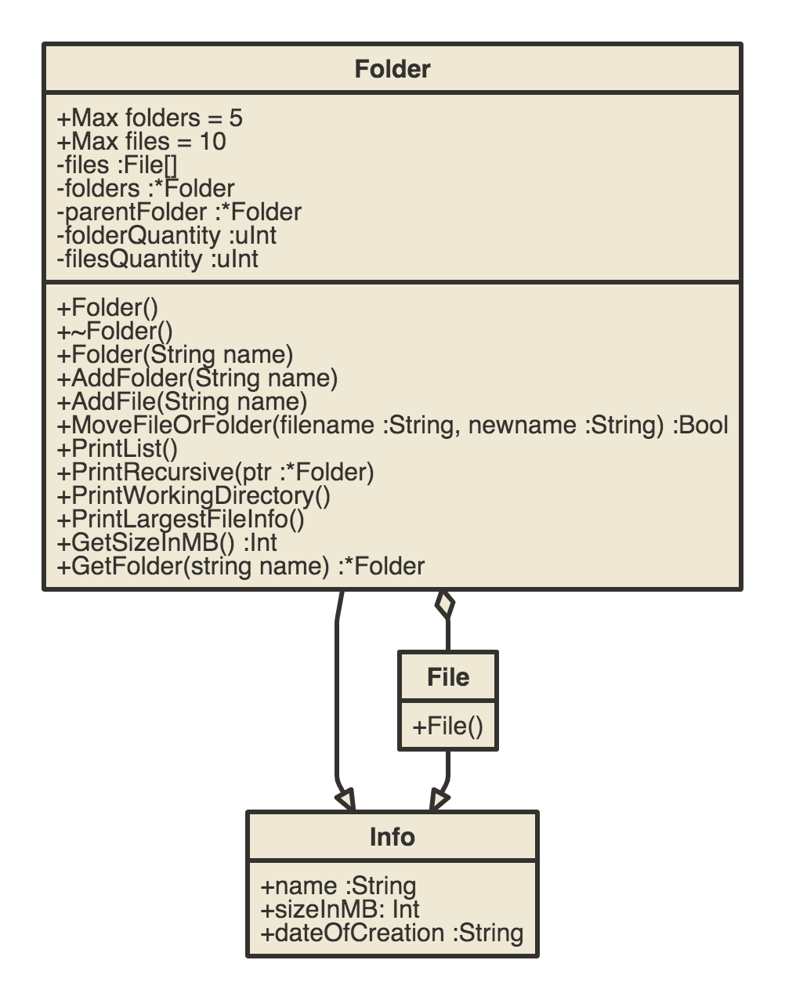

# Hans Alan Whiburn Haugen

Find my Programming-I repository and Compulsory-III branch here: [https://github.com/alanhaugen/Programming-I/tree/Compulsory3](https://github.com/alanhaugen/Programming-I/tree/Compulsory3)

## Implementation UML diagrams for the classes you have used

I have made three classes.

* Folder
* File
* Info

The relationship looks like this:

Info contains name, size and date information.

## A brief paragraph describing where you feel you are with programming, what do you feel most comfortable doing from what you\'ve learned this year, and what you feel you need to improve on the most from what you've learned this year

What I have learnt about UML.

I have also used played a bit with flex and bison for making calculators which does PEMDAS correctly. I want to look into recreating the Silicon Graphics program fsn, as seen in Jurrassic Park.

I feel I need to learn more about UML and try to understand how such diagrams can be useful for programmers.

## Documentation

I have used Doxygen to generate pretty documentation (XML).

I have made the documentation available on my website here: [https://alanhaugen.github.io/docs](https://alanhaugen.github.io/docs).

